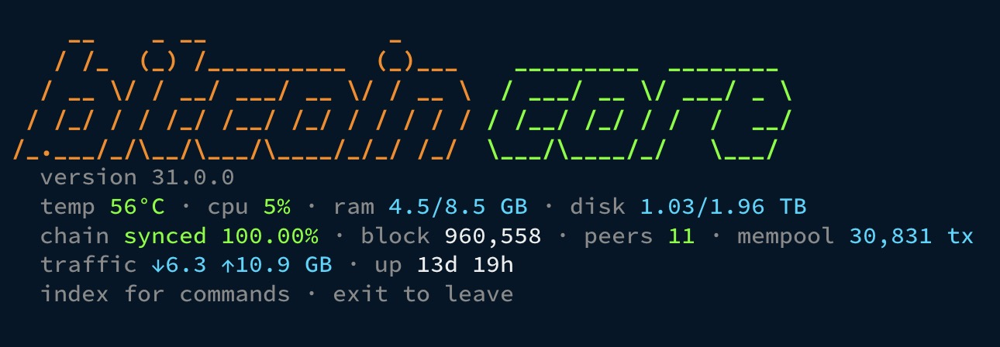
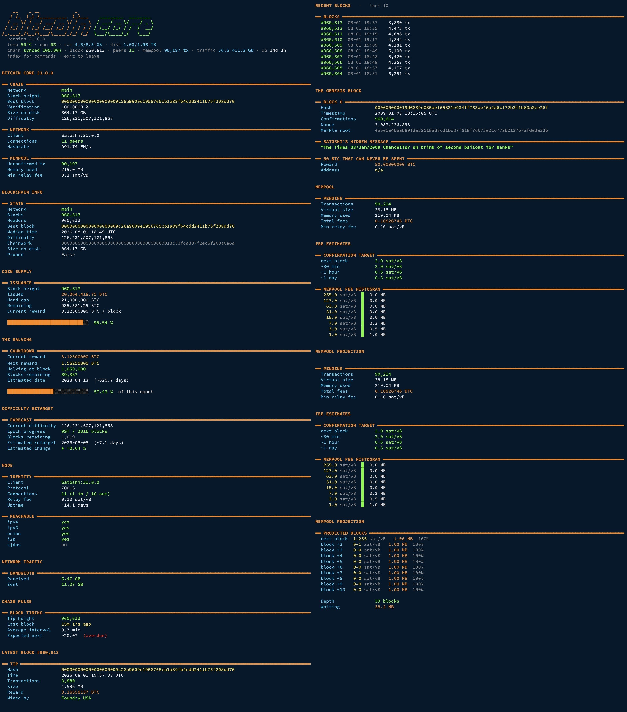

<div align="center">


# SATOSHI

**A CLI for Bitcoin Core** · Version 1.0.0

*See what's actually happening in your node. Chain, blocks, transactions, mempool, wallets and hardware, computed by the box you run it on.*

*By [Engin Sarak](https://github.com/EnginSarak)*


</div>

---

## Table of Contents

- [Overview](#overview)
- [Preview](#preview)
- [Features](#features)
  - [Chain state](#chain-state)
  - [Versions and consensus](#versions-and-consensus)
  - [Blocks and transactions](#blocks-and-transactions)
  - [Mempool and fees](#mempool-and-fees)
  - [Addresses and wallets](#addresses-and-wallets)
  - [Node hardware](#node-hardware)
  - [Miner and power](#miner-and-power)
- [Requirements](#requirements)
  - [You need your own full node](#you-need-your-own-full-node)
  - [Hardware](#hardware)
  - [Software](#software)
  - [Optional hardware](#optional-hardware)
- [Install](#install)
- [Usage](#usage)
- [Configuration](#configuration)
- [Security](#security)
- [Updating](#updating)
- [Uninstalling](#uninstalling)
- [Tech stack](#tech-stack)
- [Project structure](#project-structure)
- [Documentation](#documentation)
- [License](#license)

---

## Overview

Block explorers answer your questions by asking someone else's server. Every
lookup tells that server which address you care about, and the numbers you get
back are theirs, not yours.

SATOSHI asks your own node instead. It reads chain state, blocks, transactions,
mempool and fee data, scans watch only wallets against your own Electrs index,
reports the hardware the node runs on, and switches your Bitaxe miner on and off
through a wireless power socket. Nothing leaves the machine except the traffic
to the miner and the socket, both on your local network.

It is a single Python file with no dependencies outside the standard library.
Written for UmbrelOS on a Raspberry Pi, it works anywhere a Bitcoin Core RPC is
reachable: bare metal, Docker, RaspiBlitz, Start9.

> **You need your own synced Bitcoin Core full node to use this.** The client
> reads from that node and computes everything locally. It does not download the
> chain itself and has no public API to fall back on. See
> [Requirements](#requirements) for what that means in hardware and software.

> Not affiliated with, endorsed by, or part of Bitcoin Core. This is a
> third party tool that talks to Bitcoin Core through `bitcoin-cli`. It is not
> the official `bitcoin-cli` binary and does not replace it.

---

## Preview

<p align="center">
  
</p>

<p align="center">
  
</p>

---

## Features

### Chain state

`dashboard` is the default view: height, best block hash, verification progress,
size on disk, difficulty, client version, peers, network hashrate and mempool
size on one screen.

`info` goes deeper, with headers against blocks, median time, chainwork and
pruned state. `supply` computes issuance from the halving schedule against the
21 million cap. `halving` counts down to the next subsidy cut with an estimated
date. `retarget` forecasts the coming difficulty adjustment from actual against
expected block times inside the current epoch, clamped to the consensus limits.

`pulse` gives the chain a heartbeat: time since the last block, average interval
over the last twelve, and whether the next one is overdue. `chainstate` walks
the UTXO set for the real count of unspent outputs, computed by your node rather
than estimated.

### Versions and consensus

`versions` lists Bitcoin Core releases, marks the one your node is running and
says how many are newer. Passing a version fetches its release notes and
reflows them for the terminal.

`signals` reads soft fork signalling from your own node: the deployments your
Bitcoin Core knows about with their status, plus a tally of raw version bits
across recent blocks. A bit with no name is a proposal your node does not
implement, which is how a contested fork shows up.

### Blocks and transactions

Look up any block or transaction by height or hash. `messages` decodes OP_RETURN
outputs in a block, which is where text that people paid to include ends up.
`coinbase` reads what the miner wrote instead.

### Mempool and fees

`mempool` shows what is pending: count, virtual size, memory used and fees
waiting. `fees` combines Core's confirmation target estimates with a live fee
histogram from your Electrs index. `projection` groups the waiting mempool into
the blocks it will actually land in.

### Addresses and wallets

`addr <address>` looks up any address against your own Electrs, with confirmed
and unconfirmed balance and transaction count. No third party learns which
address you asked about.

`wallet` scans extended public keys. Give it a zpub and it derives addresses and
checks them against your index. Keys live in `wallets.txt` outside the
repository, watch only, and the tool cannot spend from them.

### Node hardware

`system` reads the machine the node runs on: SoC temperature, CPU load, memory,
disk usage and free space. The same values sit in the status header on every
start, colour coded, so a hot SoC or a filling disk is obvious without reading
the numbers.

### Miner and power

For a Bitaxe or anything else speaking the AxeOS API, `bitaxe` reports hashrate
with 1 minute, 10 minute and 1 hour averages, expected against actual,
efficiency in J/TH, ASIC and voltage regulator temperatures, fan speed and RPM,
accepted and rejected shares, session and all time best difficulty, and uptime.
`bitaxe full` adds core voltage, frequency, per ASIC hashrate domains, pool and
Wi-Fi details. `bitaxe watch` refreshes it live.

`start mining` and `stop mining` cut and restore power through a smart socket,
so the miner can go off overnight without you walking over to it. `turn` reports
the socket's state and, if it meters, voltage, current and wattage.

---

## Requirements

### You need your own full node

This is a client, not a node. It does not download the blockchain and it does
not talk to any public API. Every number it shows is read from a Bitcoin Core
instance that you run yourself, which is the whole point: no third party learns
which block, transaction or address you looked at.

So before any of this is useful, you need a synced Bitcoin Core node. The usual
way is a node distribution on a small always on machine at home:

| Distribution | Notes |
| --- | --- |
| [UmbrelOS](https://umbrel.com) | What this was built and tested on. Bitcoin Core and Electrs are one click each from the app store |
| [RaspiBlitz](https://raspiblitz.org) | Works, node runs on the host rather than in Docker |
| [Start9](https://start9.com) | Works, same as above |
| Bare metal or Docker | Any Linux or macOS box with `bitcoin-cli` in reach |

Running a pruned node is possible, but `chainstate`, historical block lookups
and wallet scans need the full chain.

### Hardware

Nothing special is needed for the client itself. It is a Python script and runs
on whatever your node runs on. The requirements below are for the **node**:

| Part | Minimum | Recommended |
| --- | --- | --- |
| Board | Raspberry Pi 4, 4 GB | [Raspberry Pi 5, 8 GB](https://www.amazon.de/dp/B0CK2FCG1K) |
| Storage | 1 TB SSD | [2 TB NVMe SSD](https://www.amazon.de/dp/B0BYW8FLKN) in a [USB 3 enclosure](https://www.amazon.de/dp/B07MNFH1PX) |
| Power | 5 V 3 A | [Official 27 W USB-C supply](https://www.amazon.de/dp/B0CM46P7MC) |
| Cooling | Passive | [Active cooler](https://www.amazon.de/dp/B0CLXZBR5P) |
| Network | Any | Wired, unmetered |

The chain alone is past 860 GB and keeps growing, and an Electrs index sits on
top of that, which is why 2 TB is the sensible size. Run the node from an SSD
over USB 3, never from an SD card. Expect the initial sync to take days.

The full parts list with reasoning is in [docs/hardware.md](docs/hardware.md).

### Software

| Requirement | Version | Needed for |
| --- | --- | --- |
| Bitcoin Core | 31.1.0 | Everything. Built and tested against this release, reachable through `bitcoin-cli`, on the host or in Docker |
| Python | 3.8 or newer | The client. Standard library only, nothing to install |
| Electrs | any | Optional. Address lookups, wallet scans, fee histogram |
| `tinytuya` | any | Optional. Only for Tuya smart plugs |

On UmbrelOS, Bitcoin Core and Electrs are apps in the store and Python is
already present, so there is nothing else to install.

### Optional hardware

| Device | What it adds |
| --- | --- |
| [Bitaxe](https://bitaxe.org) or any AxeOS miner | Hashrate, temperatures, shares, efficiency via `bitaxe` |
| Smart plug (HTTP, shell command or Tuya) | `start mining` and `stop mining` cut and restore power |

Both are skipped automatically when not configured. See
[docs/smart-plug.md](docs/smart-plug.md) for the supported plug types.

---

## Install

Make sure your node is synced first. `btc doctor` will tell you afterwards if
anything is missing, but a node still doing its initial block download has no
useful data to show yet.

```bash
curl -sSL https://raw.githubusercontent.com/EnginSarak/SATOSHI/main/install.sh | bash
source ~/.bashrc
btc setup
```

The installer writes `btc.py` to `~/.bitcoin-core-cli/` and adds the aliases
`btc` and `bitcoin`. Nothing is placed outside your home directory and no daemon
is installed.

To read the script before running it, clone the repository instead:

```bash
git clone https://github.com/EnginSarak/SATOSHI
cd SATOSHI
less install.sh
./install.sh
```

`btc setup` then detects your node, offers Electrs, and asks about wallets, a
miner and a smart plug. Every step after the node itself is optional and can be
completed later by running it again.

---

## Usage

```bash
btc                 # dashboard
btc halving         # any command directly
btc index           # list every command
bitcoin             # interactive mode
```

Inside interactive mode the `btc` prefix is dropped, and each entry in `index`
is numbered so the number alone runs it, which is useful over SSH from a phone.

```
core@bitcoin » halving
core@bitcoin » 4
core@bitcoin » exit
```

Run `guide` for an explanation of the `<placeholder>` notation and what to type
for each command.

Working remotely, see [docs/hardware.md](docs/hardware.md#remote-access) for an
SSH client recommendation. The full command reference is in
[docs/commands.md](docs/commands.md).

---

## Configuration

`btc setup` writes everything. Settings live in
`~/.bitcoin-core-cli/config.json` and can also be set through environment
variables. See [docs/configuration.md](docs/configuration.md).

Smart plugs are supported over HTTP, arbitrary shell commands, or the Tuya local
protocol. See [docs/smart-plug.md](docs/smart-plug.md).

---

## Security

The client is read only against the node. It cannot spend, sign or move coins,
opens no listening socket and runs no daemon. The only traffic leaving the
machine goes to the miner and the smart plug, both on the local network.

`rpc` is a full passthrough to `bitcoin-cli` and can do whatever `bitcoin-cli`
can do with your node's credentials. `wallets.txt` and `plug.json` hold
sensitive material and should be `chmod 600`.

---

## Updating

```bash
btc update
```

Compares the installed version against the repository and installs the newer
one, keeping a `.bak` of the previous file. The client also checks once a day in
the background and shows a one line notice at startup when an update is
available.

`btc doctor` verifies the whole setup (Python version, node, Electrs, optional
packages, miner, smart plug) and offers to install anything missing.

---

## Uninstalling

```bash
rm -rf ~/.bitcoin-core-cli
```

Then remove the `# bitcoin-core-cli alias` block from `~/.bashrc`.

For problems, see [docs/troubleshooting.md](docs/troubleshooting.md).

---

## Tech stack

| Layer | What |
| --- | --- |
| Runtime | Python 3.8+, standard library only |
| Node access | `bitcoin-cli` RPC passthrough, Docker or host |
| Index | Electrs over TCP, optional |
| Miner | AxeOS HTTP API |
| Power | HTTP, shell command, or Tuya local protocol |
| Output | Plain text, ANSI colour, no TUI framework |

---

## Project structure

```
SATOSHI/
├── btc.py                     the program, one file
├── install.sh                 installer and alias setup
├── examples/
│   ├── plug.command.json      smart plug via shell command
│   ├── plug.http.json         smart plug via HTTP
│   ├── plug.tuya.json         smart plug via Tuya local
│   └── wallets.txt            wallet list template
└── docs/                      command reference and guides
```

`config.json`, `wallets.txt` and `plug.json` are created at runtime in
`~/.bitcoin-core-cli/` and never leave the machine.

---

## Documentation

- [Commands](docs/commands.md)
- [Configuration](docs/configuration.md)
- [Smart Plug](docs/smart-plug.md)
- [Hardware](docs/hardware.md)
- [Troubleshooting](docs/troubleshooting.md)
- [Changelog](CHANGELOG.md)

---

## License

Released under the terms of the MIT license. See [LICENSE](LICENSE).
